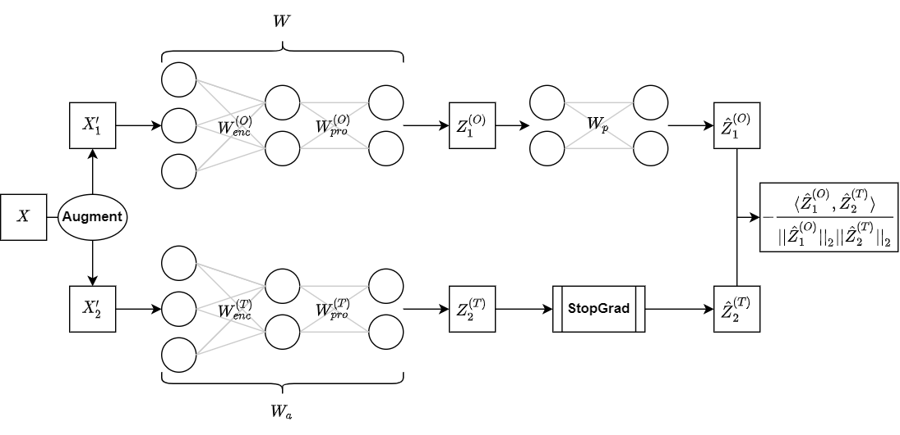
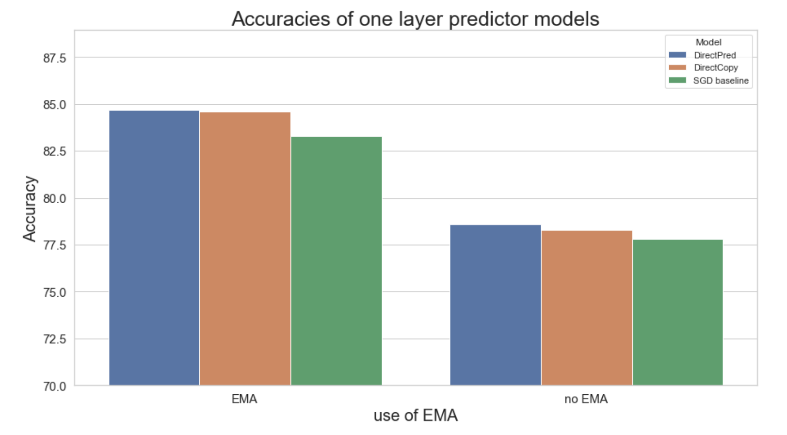
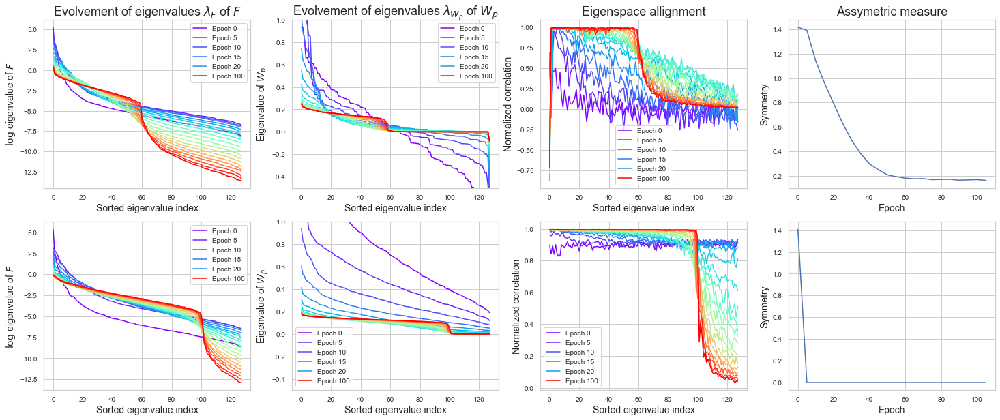

<h1 align="center">
  <b>Self-Supervised Learning without contrastive pairs</b><br>
</h1>

<p align="center">
  <i>Tobias Höppe, Agnieszka Miszkurka, Dennis Wilkman</i><br>
</p>

This repo reproduces the results of [Understanding Self-Supervised Learning Dynamics without Contrastive Pairs](https://arxiv.org/pdf/2102.06810.pdf) paper. It is a final project for Advanced Deep Learning course at KTH Royal Institute of Technology in Stockholm.

We implemented <b>all-in-one siamese netwok</b> which can work as:

* [BYOL](https://arxiv.org/pdf/2006.07733v3.pdf)
* [SimSiam](https://arxiv.org/pdf/2011.10566.pdf)
* [DirectPred](https://arxiv.org/pdf/2102.06810.pdf)
* [DirectCopy](https://arxiv.org/pdf/2110.04947.pdf)


# Environment

The project is implemented with Tensorflow 2. Prepare an virtual environment with python>=3.6, and then use the following command line for the dependencies.

```
pip install -r requirements.txt
```

# Project overview

The project structure is as follows:

```bash
.
├── data_processing
├── experiments
│   ├── notebooks
│   │   ├── results_eigenspace
│   │   └── saved_model
│   ├── scripts
│   │   ├── results_eigenspace
│   │   └── saved_model
│   └── visualisation
└── models

```

### Data processing
 
Contains augmentations and methods for processing CIFAR-10 and STL-10.

### Experiments

Contains notebooks and scripts for running experiments along with visualisation utilities.

All parameter settigns can be found in `config.py`.

### Models

Contains models for self-supervised pre-training (`SiameseNetwork`) and finetuning 
(`ClassificationNetwork`) and their building blocks.

# Network architecture



Siamese network consists of two networks with the same architecture. ResNet-18 () as encoder, which is supposed to create hidden features and a projector head , which is a two layer MLP, with purpose to map the feature space into a lower dimensional hidden space. The online network also has an additional predictor head, again consisting of a two layer MLP. The target network has a <i>StopGrad</i> function instead of a predictor head. Therefore during back propagation, only the weights of the online network are updated. The loss between the output of the online and target network is equal to the cosine-similarity loss function. Note, that the final loss of one image is the symmetric loss  + , since each augmentation is given to both networks.

# Experiments

## How to run 

To run training pipeline (pretraining + finetuning), from the main directory, run:

```bash
python train.py --model MODEL_NAME --name SAVE_DIR_NAME
```

Where `MODEL_NAME` can be one of: byol, simsiam, directpred,directcopy.
You can also specify number of epochs for pretraining with `--epochs_pretraining` flag (default: 101) and finetuning with `--epochs_finetuning` flag (default: 50). 

Additionaly the following flags can be used to run different experiments:

- `--symmetry`           to impose symmetry regularisation on predictor (Wp)
-  `--eigenspace`          to track eigenspace evolvement. Results of eigenspace evolvement are saved in `results/SAVE_DIR_NAME/eigenspace_results`
- `--one_layer_predictor`
                        Make predictor consist of only one layer (only applicable to BYOL and SimSiam)


Pretrained encoder will be saved in `results/SAVE_DIR_NAME` directory as a `.h5` file. Finetuned classifier will be saved in `results/SAVE_DIR_NAME/classifier` as a keras model.

There are models already available in those folders.

To check the final accuracy on the test set run 

```bash
python test.py --name SAVE_DIR_NAME
```

Alternatively, you can use jupyter notebook, for example see `experiments/notebooks/direct_pred.ipynb`.

## Configuration 

Below are all available configurations which can be found in `config.py`.

|  Network \ Settings | original                             | Symmetry regularisation                 | One layer predictor  (original: two layers) |
|---------------------|--------------------------------------|-----------------------------------------|---------------------------------------------|
| BYOL                | get_byol / get_eigenspace_experiment | get_eigenspace_experiment_with_symmetry | get_byol_baseline                           |
| SimSiam             | get_simsiam                          | get_simsiam_symmetric                   | get_simsiam_baseline                        |


|  Network \ Settings | original        | SimSiam          | 3 layer predictor     |
|---------------------|-----------------|------------------|-----------------------|
| DirectPred          | get_direct_pred | get_simsiam_pred | get_deeper_projection |
| DirectCopy          | get_direct_copy |                  |                       |

### SimSiam with symmetric predictor

Stable (not collapsing) version of SimSiam with symmetric predictor (with different learning rate and weight decay for predictor and the rest of the network) can be found on branch 
`simsiam_predictor`.


# Results

For detailed results see report of our project.
All our experiments were run on CIFAR-10 due to computational constraints. 
Self-Supervised pretraining takes around 4 hours 30 minutes on GCP's V100.

## Accuracy on CIFAR-10
<div align="center">

| Model | Config | Accuracy  |
|-------|---------|------------|
| BYOL | get_byol | 85.7% |
| SimSiam | get_simsiam | 79.4%|  



Figure 1: Results for DirectPred and DirectCopy with and without EMA. SGD baseline is BYOL with one layer predictor. 

</div>

## Eigenspace allignment

First, we pre-train BYOL and SimSiam keep track of the predictor heads symmetry and eigenspace
alignment. In Figure 2 we can see, that the assumption of an symmetric predictor  holds. Even
without symmetry regularisation, Wp approaches symmetry during training. Also, we can see that for
all non-zero eigenvalues of Wp the eigenspaces between F and  align as the training progresses.

<div align="center">


Figure 2: Pre-training BYOL for 100 epochs of CIFAR-10. Top row: BYOL without symmetry
regularisation on . Bottom row: BYOL with symmetry regularisation on . The eigenvalues of
F are plotted on the log scale, since the eigenvalues vary a lot.
</div>
